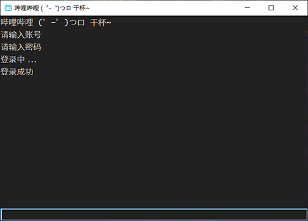

# Bilibili-PC
用Python实现获取B站个人推荐页




## 依赖

- requests
- rsa
- Pillow
- PySide6
- toml
- chardet


## 功能

| 功能          | 版本      | 描述           |
| ------------- | --------- | -------------- |
| login         | 2021.8.26 | 登录           |
| login token   | 2021.8.26 | 通过Token登录  |
| refresh token | 2021.8.26 | 刷新Token      |
| info          | 2021.8.26 | 获取个人信息   |
| recommend     | 2021.8.26 | 获取个人推荐页 |
| help          | 2021.8.26 | 帮助           |
| clear         | 2021.8.26 | 清屏           |
| exit          | 2021.8.26 | 退出应用       |


## 使用

### 源代码版本

克隆本代码仓库，使用pip安装依赖，并修改默认配置文件config.toml

```
git clone https://github.com/VCisHere/Bilibili-PC.git
cd Bilibili-PC
python bilibili.py
```

### 二进制版本

从[Release页面](https://github.com/VCisHere/Bilibili-PC/releases)下载并解压压缩包，修改默认配置文件config.toml后运行可执行文件bilibili


## 鸣谢

本项目的灵感与使用到的部分API来自以下项目：

> [SocialSisterYi/bilibili-API-collect](https://github.com/SocialSisterYi/bilibili-API-collect)

